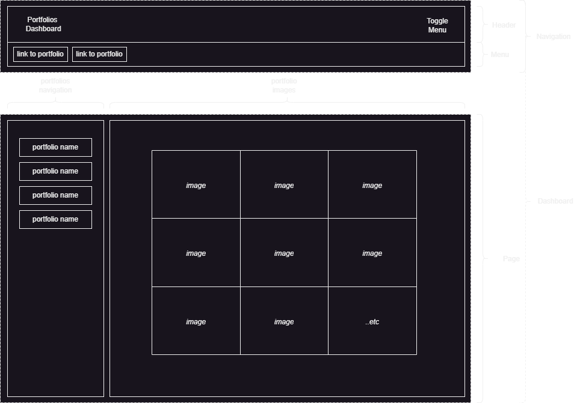

# Media College

```
Author      : Media College
Department  : WEB 
Year        : 2024 
Description : Opgave efter Kapitel 1 & 2
Doc         : portfolio_dahboard.md                     
```
### Indledning.

Portfolio Dashboard.

Du skal udarbejde et portfolio dashboard.




### Dashboard / One Page(r).

Ovenstående billede er hvad der forvents. En forside hvor man via menu´en giver mulighed for at få et "split-view" med links til alle porfolier i venstre side og tilsvarene billeder i højre.

Der er ikke rigtig taget stilling til, hvad der sker når man **ikke** har valgt et galleri eller portfolio. Det er op til dig.

### :dart: Opgaver.

1. DESIGN: (adobe)
Lav et design. Det behøver ikke være "eksotisk", tænk i komponent design og noget du skal arbejde med i nextjs.

2. PROTOTYPE:   
Omsæt designet til en ren html og css prototype. ingen js nødvendig ren template.

### :dart: Projekt Styring og Tidsplan

1. Du laver en tidsplan for
    1. Design Fasen
    2. Prototype Fasen
    3. Udviklings Fasen.

Det er klart at du i starten må anslå. 

Men vi vil gerne have et tal for hvor lang tid du forestiller dig at benytte på alle tre faser samlet, inden du begynder. 

Så forsøg at nedbryd din opgave og de forskellige faser.

Aflever en deadline, projekstyring, design (XD), og link til dit projekt og aflever dette til din projektleder.

Sammen godkender vi den ansæået deadline.

:bulb: Når man starter på hver fase så får man sikkert behov for at nedbryde anderledes og med andre opgaver end dem man startede med. Dem man starter med at anslå er mere generelle.


## Det er enormt svært det véd vi godt. 

Så brug ikke for meget tid på det her til at starte med.

Du skal som minimum aflevere:

| Opgaver                               | Varighed      | 
| -                                     |:-------------:| 
| Design Fasen                          | x-timer       | 
| Prototype Fasen                       | x-timer       | 
| Udviklings Fasen                      | x-timer       | 
| ialt                                  | x-timer       | 

Omsæt timer til forventede antal dag. (vi regner med 5 timers udvikling på en hel dag.)     
**(x-timer i alt/5) = x dage.**

Dette er simpelt men bedre end ingenting - det gælder om at forsøge at vurdere sit egen tidsforbrug og opfattelse af tid når først *toget* køre. 

I må ikke tænke hurtigt er *bedre* men være realistisk og det er helt okey at skyde forbi og rette ind.

Det er et sammenspil.

:bulb: Tænk ikke i mobile-first nødvendigvis - Det er et dashboard.

:muscle: God Arbejdslyst.