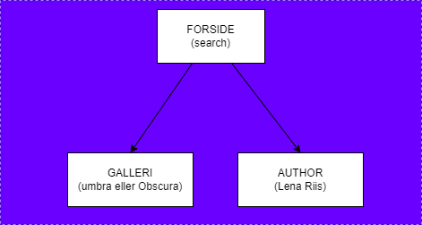

# Opgave.

```
Author      : Media College
Department  : WEB 
Year        : 2024 
Description : Portfoile API ogave         
```
Flow.        


1. Opret et projekt. (Kopi eller fra bunden)
2. Forsiden skal indeholde search.
2. Fra Søge resultaterne skal man kunne klikke på
    1. Galleri Navnet 
        1. Og dermed komme til en side med enten obscura eller umbra billeder i en karrusel.
    2. Auhtor Navnet
        1. Og dermed lande på en side med en Auhtors billeder i en karrusel.
4. Ekstra: Paging knapper, vi har lige nu "Next" og "Previous" men hvordan får vi en knap for hver side i vores paging.
I bestemmer selv, hvordan og hvroledes!

God Arbejdslyst.